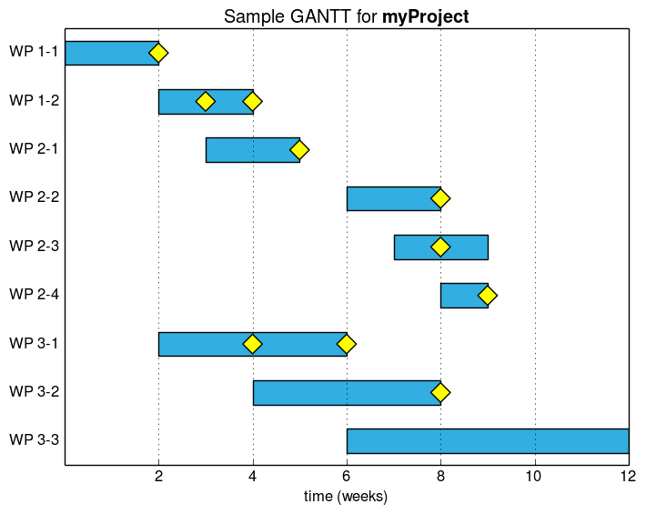

[](https://travis-ci.org/stefanSchinkel/gantt)
###README

gantt.py is a python class to produce, well, Gantt charts. The charts are kept (very) simple, using a discreet time scale, unicolor bars and optional milesstones. Adapt the data structure according to your needs.

###Background
Gantt charts are commonly used in project management. I had to make one myself and LibreProject was way too involved for that. Hence I used OOCalc and a plain horizontal bar chart. That took some time but was ok. One day I was requested to add milestones (basically just a marker) to the chart. I completely failed doing this in OOCalc (and still don't know how to do that ...).

Long story short: I don't know how to [excel](https://xkcd.com/559/).

### Basic usage

```python
from gantt import Gantt         # import
g = Gantt("data.json")          # init
g.render()                      # render
g.barlist[2].set_color('#F1C231')    # color individual bars
g.show()                            # or save w/ g.save('foo.png')
```

### Data structure :construction:

All data is provided as a JSON structure that **has to  contain**:

 - a dictionary-like object packages with the name as key and start/end as value. This provides the basic structure. Start and end value are discreet.
 - a title string (may contain TeX, escaped)

```json

{
"packages" : {
    "A": "0, 2",
    "C": "2, 4",
    "D": "3, 5",
   },

"title" : "Sample GANTT for \\textbf{myProject}"
}
```

Optionally the JSON may also contain:

 - a dictionary mapping milestones to packages
 - a label for the x-axis
 - a definition of where set tickmarks

```json

{
"milestones" : {
    "A": [2],
    "B": [3, 4],
    },
"xlabel" : "time (weeks)",
"xticks" :  [2,4,6,8,10,12]
}
```

See [sample.json](./sample.json) for the data used to produce the image below.
### Requirements

 - numpy
 - matplotlib

### ToDo
 - nicer data structure (JSON) :construction:
 - dedicated class for packages :construction:
 - add parameter object/dict for more control over colors etc

###Screenshot


See [sample.json](./sample.json) for definition.